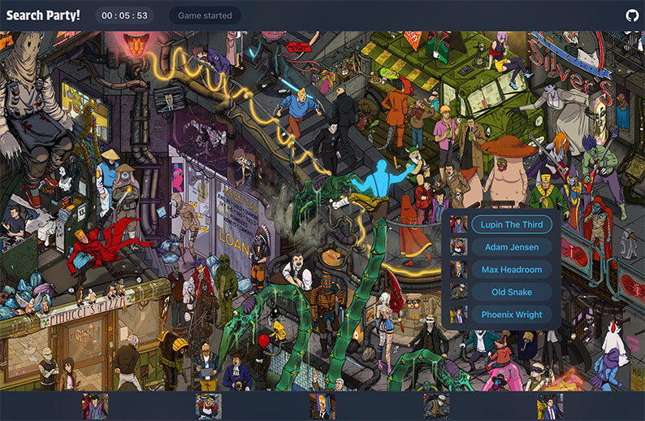

# photo-tag-app

Site is currently deployed [here](https://search-party.onrender.com).

This monorepo is made for deploying my photo-tag-backend and photo-tag-frontend to hosting providers.

This app is a Where's Waldo-like game where players are given 5 random characters out of 33 to find. The characters are from various media franchises. Once you win, you can submit your name and see if you made the leaderboard. You are given one place on the leaderboard (unless your cookie goes bye-bye). Your time can only be overwritten by yourself if you surpass your previous best time.

# Local Installation

1. Clone this repository

2. Navigate to the project in terminal and run the build script

```console
$ cd photo-tag-app && npm run build
```

2. Navigate to the backend folder and create a .env file. Add a secure SECRET variable and a MONGODB_URI variable containing your mongoDB connection string

```console
$ cd backend && touch .env
```

4. Navigate to backend/populateDB and compile the populateDB.ts file and run the resulting script

```console
$ cd populateDB && tsc populateDB.ts && node populateDB.js
```

5. Navigate to the build directory (dist) in root and run www.js

```console
$ cd dist && node www.js
```

6. Open localhost:3000 in your browser to view the project


